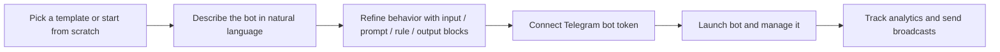

# PromptCraft

> Build AI-powered Telegram bots from prompts, templates, and visual blocks.


PromptCraft is a user-facing AI builder for creating Telegram bots without writing backend code. Users can start from ready-made templates, describe behavior in natural language, assemble logic with visual blocks, connect a bot token, and launch a working experience with analytics and broadcast tooling included.

## Why PromptCraft

Creating a useful Telegram bot usually means juggling prompts, flows, deployment, onboarding, and admin tools across several products. PromptCraft pulls that into one experience:

- Visual block-based builder for bot behavior
- AI agent that turns user intent into bot logic
- Ready-to-launch templates for common business cases
- Telegram bot creation flow with webhook support
- Broadcasts and admin analytics in the same product

## Product Flow



## Core Features

| Area | What it does |
| --- | --- |
| AI builder | Generates or improves bot logic from a prompt and block configuration |
| Templates | Includes ready-made scenarios like store, support, promo, booking, and lead capture |
| Telegram integration | Connects a BotFather token, validates it, and registers a webhook |
| Web app UI | Lets users manage projects in a lightweight browser interface |
| Broadcasts | Sends targeted messages to bot audiences |
| Analytics | Tracks basic product metrics such as DAU, CTR, and retention |
| Fallback behavior | Supports mock mode when no AI key is configured |

## Example Use Cases

- Support and FAQ bots for small teams
- Lead collection bots for agencies and service businesses
- Promo code and campaign bots for marketing
- Booking assistants for salons, clinics, and appointments
- Content delivery bots for media and education

## Stack

- Backend: Node.js, Express
- Telegram: Telegraf, Telegram Web App
- AI: Google Gemini or OpenRouter
- Storage: local JSON files in the current MVP
- Deployment: Vercel or a VPS with webhook mode

## Quick Start

```bash
cp .env.example .env
npm install
npm run dev
```

Open `http://localhost:3000` after the server starts.

## Environment Variables

Minimal setup:

```env
TELEGRAM_BOT_TOKEN=your_token_from_botfather
PORT=3000
PUBLIC_BASE_URL=http://localhost:3000
```

Optional AI and production settings:

| Variable | Required | Purpose |
| --- | --- | --- |
| `TELEGRAM_BOT_TOKEN` | Yes | Main Telegram bot token |
| `PORT` | No | Local server port |
| `PUBLIC_BASE_URL` | No | Public base URL used for Web App buttons and callbacks |
| `WEBHOOK_URL` | No | Enables webhook mode in production |
| `GEMINI_API_KEY` | No | Enables Gemini-based AI responses |
| `GEMINI_MODEL` | No | Overrides the Gemini model |
| `OPENROUTER_API_KEY` | No | Enables OpenRouter-based AI responses |
| `OPENROUTER_MODEL` | No | Overrides the OpenRouter model |
| `APP_ORIGIN` | No | Public app origin used as request referer for AI providers |
| `ADMIN_IDS` | No | Comma-separated Telegram user IDs for admin commands |

See [.env.example](./.env.example) for the full template.

## BotFather Checklist

Before using a real Telegram bot, configure it in `@BotFather`:

1. Run `/newbot` and get your `TELEGRAM_BOT_TOKEN`
2. Set `/setdescription` and `/setabouttext`
3. Set `/setuserpic`
4. Set `/setdomain` to your `PUBLIC_BASE_URL` domain
5. Optionally set `/setpayments` if you add payment flows

Recommended commands:

```text
start - Main onboarding flow
menu - Main menu
templates - Open templates
app - Open web builder
course - Mini course
faq - Frequently asked questions
cancel - Cancel current action
```

## API Overview

| Method | Route | Purpose |
| --- | --- | --- |
| `GET` | `/health` | Health check |
| `POST` | `/api/projects` | Create or update a project |
| `GET` | `/api/projects/:id` | Fetch one project |
| `DELETE` | `/api/projects/:id` | Delete a project |
| `GET` | `/api/users/:userId/projects` | List projects for a user |
| `POST` | `/api/agent/run` | Run the AI agent |
| `POST` | `/api/bots/create` | Create and connect a Telegram bot |
| `POST` | `/api/deploy` | Deploy a generated bot to a VPS over SSH |

## Project Structure

```text
src/
  bot/            Telegram handlers and state
  middleware/     Logging, validation, rate limiting, errors
  repositories/   JSON-based persistence layer
  routes/         API routes
  services/       AI, analytics, broadcasts, deploy, templates
  app.js          Express app factory
  index.js        App entry point
  vercel.js       Vercel adapter
public/           Frontend Web App
data/             Local JSON storage
```

## Deployment

### Local development

```bash
npm run dev
```

If you want Telegram Web App features to work in development, expose your local server with a public tunnel and set `PUBLIC_BASE_URL`.

### Production with webhook mode

```bash
npm start
```

Set:

```env
PUBLIC_BASE_URL=https://your-domain.com
WEBHOOK_URL=https://your-domain.com
```

### Vercel

The repo includes [vercel.json](./vercel.json) and a serverless entry point in [src/vercel.js](./src/vercel.js).

```bash
vercel deploy
```

## Public Repo Notes

This public version is prepared for safe sharing:

- No local project data is included
- No `.env` file is committed
- Local tool settings are excluded
- AI provider origin is configurable through environment variables

## Roadmap

- Move persistence from JSON files to PostgreSQL
- Add Telegram Web App auth validation
- Expand template library
- Add scheduled broadcasts
- Export analytics to CSV
- Improve multi-turn AI bot behavior
- Add payment integrations

## Status

PromptCraft is currently an MVP focused on validating the core builder experience and Telegram launch flow.
